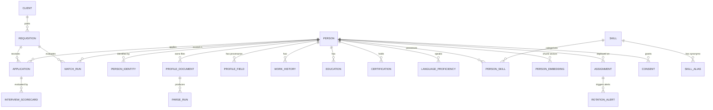

# Database Schema Architecture & Data Dictionary

This document details the complete 9-domain database schema for the **ENUM Talent Intelligence Platform** adhering to the 57-module Build Specification, PostgreSQL 16 engine features (`pgvector`, `pg_trgm`, `unaccent`), and Oman Personal Data Protection Law (PDPL).

---

## 1. Entity-Relationship Overview

---

## 2. Complete 9-Domain Data Dictionary

### Domain 1: Identity & Cross-Border Profile (Story 1020)
* **`person` (Unified Candidate & Consultant Model - Data Decision #1):**
  * `id` (UUID, PK)
  * `tenant_id` (UUID, RLS indexed)
  * `full_name` (VARCHAR 255, GIN `pg_trgm` indexed for fuzzy name search)
  * `nationality` (VARCHAR 100 — *e.g., Omani, Pakistani, Indian*)
  * `primary_location` (VARCHAR 255 — *e.g., Muscat, Karachi, Lahore*)
  * `visa_status` (VARCHAR 100 — *e.g., citizen, employment_visa, visit_visa, needs_sponsorship*)
  * `notice_period_days` (INTEGER)
  * `employment_state` (VARCHAR 50 — `candidate`, `internal_bench`, `deployed`, `alumni` — *Bench state derived per M28*)
  * `created_at` & `updated_at` (TIMESTAMPTZ)
* **`person_identity`:**
  * `id` (UUID, PK), `tenant_id` (UUID), `person_id` (UUID, FK -> `person.id`)
  * `identity_type` (VARCHAR 50 — `email`, `phone`, `national_id`, `passport`, `linkedin`)
  * `value` (VARCHAR 255, normalized E.164 phone / lowercase email)
  * `is_primary` (BOOLEAN), `verified_at` (TIMESTAMPTZ, nullable)
  * **Constraint:** `UNIQUE (tenant_id, identity_type, value)`

---

### Domain 2: CV Ingestion, Parse Versioning & Field Provenance (Stories 1020, 1025)
* **`profile_document`:**
  * `id` (UUID, PK), `tenant_id` (UUID), `person_id` (UUID, FK -> `person.id`)
  * `file_name` (VARCHAR 255), `minio_bucket` (VARCHAR 100), `minio_object_key` (VARCHAR 500)
  * `file_hash_sha256` (VARCHAR 64 — *Deduplication index to prevent re-processing identical CVs*)
  * `mime_type` (VARCHAR 100), `extraction_status` (`pending`, `parsed`, `failed`)
  * `uploaded_at` (TIMESTAMPTZ)
* **`parse_run` (Data Decision #3 - Model & Prompt Versioning):**
  * `id` (UUID, PK), `tenant_id` (UUID), `document_id` (UUID, FK -> `profile_document.id`)
  * `model_alias` (VARCHAR 100 — *e.g., enum-extract*)
  * `model_version` (VARCHAR 100 — *e.g., qwen2.5-3b-q4_k_m*)
  * `prompt_version` (VARCHAR 50 — *e.g., v1.2.0*)
  * `raw_output` (JSONB — *complete structured JSON before normalization*)
  * `overall_confidence` (FLOAT)
  * `executed_at` (TIMESTAMPTZ, *Append-Only*)
* **`profile_field` (Data Decision #2 - Provenance Ladder):**
  * `id` (UUID, PK), `tenant_id` (UUID), `person_id` (UUID, FK -> `person.id`)
  * `field_path` (VARCHAR 255 — *e.g., contact.phone, experience[0].role*)
  * `field_value` (JSONB)
  * `source` (`regex`, `gazetteer`, `ner`, `llm`, `ocr`, `agency`, `self_service`, `recruiter`)
  * `confidence_score` (FLOAT 0.0–1.0)
  * `parse_run_id` (UUID FK, nullable), `verified_by` (UUID FK, nullable), `verified_at` (TIMESTAMPTZ, nullable)

---

### Domain 3: Structured Entities (Story 1026)
* **`work_history`:**
  * `id` (UUID, PK), `tenant_id` (UUID), `person_id` (UUID, FK -> `person.id`)
  * `company_name` (VARCHAR 255, GIN `pg_trgm` indexed), `role_title` (VARCHAR 255)
  * `location_city` (VARCHAR 100), `location_country` (VARCHAR 100)
  * `start_date` (DATE), `end_date` (DATE, nullable), `is_current` (BOOLEAN)
  * `description` (TEXT), `technologies` (TEXT[] — *instant filtering for Core Banking: Temenos, Finacle, Oracle*)
* **`education`:**
  * `id` (UUID, PK), `tenant_id` (UUID), `person_id` (UUID, FK -> `person.id`)
  * `institution_name` (VARCHAR 255), `degree` (VARCHAR 100), `field_of_study` (VARCHAR 255), `graduation_year` (INTEGER)
* **`certification`:**
  * `id` (UUID, PK), `tenant_id` (UUID), `person_id` (UUID, FK -> `person.id`)
  * `name` (VARCHAR 255), `issuing_organization` (VARCHAR 255), `issue_date` (DATE), `expiry_date` (DATE, nullable), `credential_id` (VARCHAR 100), `is_verified` (BOOLEAN)
* **`language_proficiency`:**
  * `id` (UUID, PK), `tenant_id` (UUID), `person_id` (UUID, FK -> `person.id`)
  * `language_code` (VARCHAR 10 — `en`, `ar`, `ur`)
  * `proficiency` (`native`, `fluent`, `professional`, `basic`)

---

### Domain 4: Client Demand & Requisitions (Module M26)
* **`client`:**
  * `id` (UUID, PK), `tenant_id` (UUID), `name` (VARCHAR 255 — *e.g., Bank of Oman*), `country` (VARCHAR 100), `contact_person` (VARCHAR 255), `contact_email` (VARCHAR 255)
* **`requisition`:**
  * `id` (UUID, PK), `tenant_id` (UUID), `client_id` (UUID, FK -> `client.id`)
  * `role_title` (VARCHAR 255), `domain` (VARCHAR 100 — *Banking/Fintech*), `required_years_experience` (FLOAT), `target_location` (VARCHAR 100 — *Muscat*), `headcount` (INTEGER), `status` (`draft`, `open`, `filled`, `closed`)

---

### Domain 5: Match Engine & Explainability (Data Decision #4 & Module M29)
* **`match_run` (Persisted Explainable AI Scores):**
  * `id` (UUID, PK), `tenant_id` (UUID), `requisition_id` (UUID, FK -> `requisition.id`), `person_id` (UUID, FK -> `person.id`)
  * `total_score` (FLOAT)
  * `component_scores` (JSONB — *must-have coverage %, seniority fit, domain fit, location fit, recency score*)
  * `narrative_summary` (TEXT — *LLM-generated explanation, never black-box*)
  * `model_version` (VARCHAR 100), `executed_at` (TIMESTAMPTZ)

---

### Domain 6: Hiring Pipeline & Scorecards (Modules M34, M35)
* **`application`:**
  * `id` (UUID, PK), `tenant_id` (UUID), `requisition_id` (UUID, FK), `person_id` (UUID, FK)
  * `stage` (`sourced`, `screened`, `client_shared`, `interviewing`, `offered`, `placed`, `rejected`)
  * `blind_mode_active` (BOOLEAN — *server-side PII redaction per M30*)
  * `shared_with_client_at` (TIMESTAMPTZ, nullable), `created_at` (TIMESTAMPTZ)
* **`interview_scorecard`:**
  * `id` (UUID, PK), `tenant_id` (UUID), `application_id` (UUID, FK)
  * `interviewer_name` / `interviewer_id` (VARCHAR 255)
  * `ratings` (JSONB — *technical, domain, communication*), `recommendation` (`strong_hire`, `hire`, `hold`, `reject`)
  * `is_submitted` (BOOLEAN — *ratings hidden from other interviewers until submitted to prevent anchoring per M35*)

---

### Domain 7: Deployments & 1+ Year Bench Lifecycle (Modules M27, M28, M32)
* **`assignment`:**
  * `id` (UUID, PK), `tenant_id` (UUID), `person_id` (UUID, FK), `client_id` (UUID, FK), `requisition_id` (UUID, FK, nullable)
  * `start_date` & `end_date` (DATE — *tracking 12–24 month engagements*)
  * `status` (`active`, `completed`, `extended`, `terminated`)
  * `currency` (VARCHAR 10 — `OMR`, `USD`, `PKR`), `bill_rate` (DECIMAL 12,2), `cost_rate` (DECIMAL 12,2)
* **`rotation_alert`:**
  * `id` (UUID, PK), `tenant_id` (UUID), `assignment_id` (UUID, FK)
  * `threshold_days` (INTEGER — `90`, `60`, `30` days before contract expiry)
  * `alert_type` (`extension_due`, `bench_rotation`, `offboarding`), `status` (`pending`, `acknowledged`, `resolved`)

---

### Domain 8: Skills & Section-Level Embeddings (Story 1027, Modules M15, M20)
* **`skill`:** `id` (UUID, PK), `canonical_name` (VARCHAR 255, UNIQUE), `category` (VARCHAR 100), `esco_uri` (VARCHAR 500)
* **`skill_alias`:** `id` (UUID, PK), `skill_id` (UUID, FK -> `skill.id`), `alias` (VARCHAR 255, Normalized Lowercase Unique)
* **`person_skill`:** `id` (UUID, PK), `tenant_id` (UUID), `person_id` (UUID, FK), `skill_id` (UUID, FK), `proficiency` (VARCHAR 50), `years_experience` (FLOAT), `last_used_at` (DATE, nullable), `evidence_ref` (VARCHAR 255)
* **`person_embedding` (Section-Level Chunking per M20):**
  * `id` (UUID, PK), `tenant_id` (UUID), `person_id` (UUID, FK)
  * `chunk_type` (`full_profile`, `role_experience`, `education`, `skills_summary`)
  * `chunk_ref_id` (UUID, nullable — points to `work_history.id` or `education.id`)
  * `embedding` (`vector(384)`, HNSW Cosine Indexed via `pgvector`)
  * `model_version` (VARCHAR 100 — `multilingual-e5-small-int8`)

---

### Domain 9: Governance & Lineage (Story 1028, Modules M16, M55 - Oman PDPL)
* **`consent`:** `id` (UUID, PK), `tenant_id` (UUID), `person_id` (UUID, FK), `purpose` (VARCHAR 100), `lawful_basis` (VARCHAR 100), `status` (`granted`, `revoked`), `granted_at` (TIMESTAMPTZ), `expires_at` (TIMESTAMPTZ)
* **`audit_log`:** `id` (UUID, PK), `tenant_id` (UUID), `actor_id` (UUID), `action` (`VIEW_PII`, `EXPORT_RESUME`, `REVEAL_IDENTITY`), `target_entity` (VARCHAR 255), `accessed_fields` (TEXT[]), `created_at` (TIMESTAMPTZ, *Append-Only*)
* **`merge_lineage`:** `id` (UUID, PK), `tenant_id` (UUID), `source_person_id` (UUID), `target_person_id` (UUID), `merged_by` (UUID), `merged_at` (TIMESTAMPTZ), `snapshot_before_merge` (JSONB — *Enables reversible deduplication per M16*)
